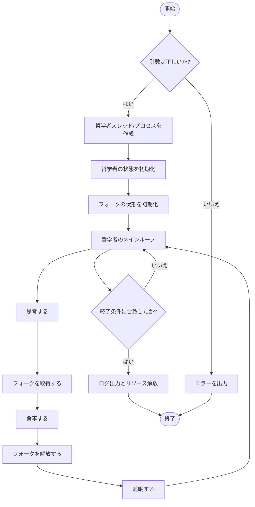
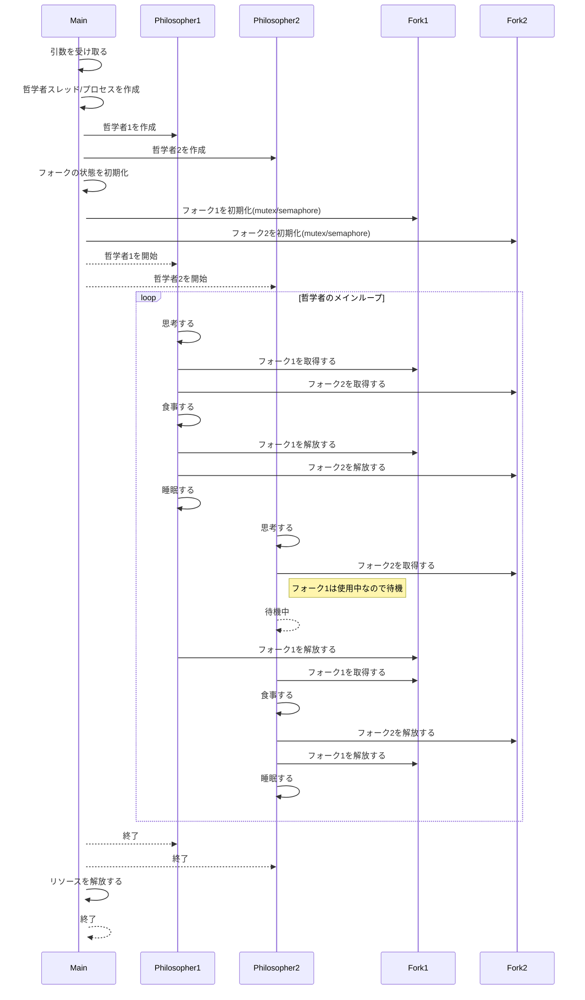

# ph1l0s0pher

```mermaid
flowchart TD
    Start([開始]) --> InputArgs[引数を受け取る]
    InputArgs{引数は正しいか?}
    InputArgs -- はい --> CreatePhilos[哲学者スレッド/プロセスを作成]
    CreatePhilos --> InitPhiloStates[哲学者の状態を初期化]
    InitPhiloStates --> InitForkStates[フォークの状態を初期化]
    InitForkStates --> PhiloMainLoop[哲学者のメインループ]
    PhiloMainLoop --> Think[思考する]
    Think --> GetForks[フォークを取得する]
    GetForks --> Eat[食事する]
    Eat --> ReleaseForks[フォークを解放する]
    ReleaseForks --> Sleep[睡眠する]
    Sleep --> PhiloMainLoop
    PhiloMainLoop --> CheckDeath[哲学者が死んだかチェック]
    CheckDeath{終了条件に合致したか?}
    CheckDeath -- はい --> OutputAndCleanup[ログ出力とリソース解放]
    OutputAndCleanup --> End([終了])
    CheckDeath -- いいえ --> PhiloMainLoop
    InputArgs -- いいえ --> OutputError[エラーを出力]
    OutputError --> End([終了])
```

```mermaid
sequenceDiagram
    participant Main
    participant Philosopher1
    participant Philosopher2
    participant Fork1
    participant Fork2

    Main->>+Main: 引数を受け取る
    Main->>+Main: 哲学者スレッド/プロセスを作成
    Main->>Philosopher1: 哲学者1を作成
    Main->>Philosopher2: 哲学者2を作成

    Main->>+Main: フォークの状態を初期化
    Main->>Fork1: フォーク1を初期化(mutex/semaphore)
    Main->>Fork2: フォーク2を初期化(mutex/semaphore)

    Main-->>Philosopher1: 哲学者1を開始
    Main-->>Philosopher2: 哲学者2を開始

    loop 哲学者のメインループ
        Philosopher1->>Philosopher1: 思考する
        Philosopher1->>Fork1: フォーク1を取得する
        Philosopher1->>Fork2: フォーク2を取得する
        Philosopher1->>Philosopher1: 食事する
        Philosopher1->>Fork1: フォーク1を解放する
        Philosopher1->>Fork2: フォーク2を解放する
        Philosopher1->>Philosopher1: 睡眠する

        Philosopher2->>Philosopher2: 思考する
        Philosopher2->>Fork2: フォーク2を取得する
        Note right of Philosopher2: フォーク1は使用中なので待機
        Philosopher2-->>Philosopher2: 待機中
        Philosopher1->>Fork1: フォーク1を解放する
        Philosopher2->>Fork1: フォーク1を取得する
        Philosopher2->>Philosopher2: 食事する
        Philosopher2->>Fork2: フォーク2を解放する
        Philosopher2->>Fork1: フォーク1を解放する
        Philosopher2->>Philosopher2: 睡眠する
    end

    Main-->>Philosopher1: 終了
    Main-->>Philosopher2: 終了
    Main->>+Main: リソースを解放する
    Main-->>Main: 終了
```
